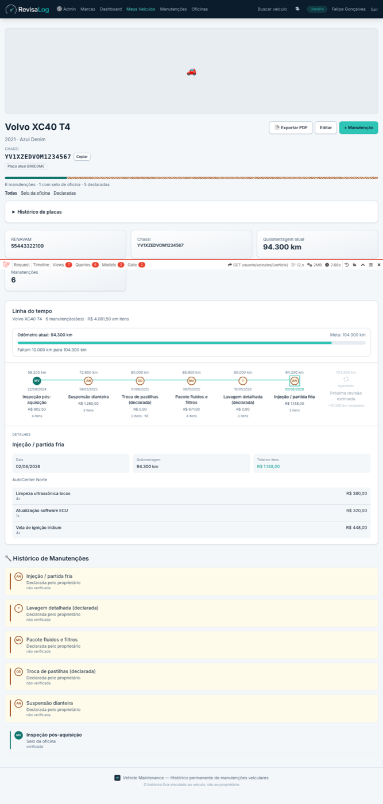
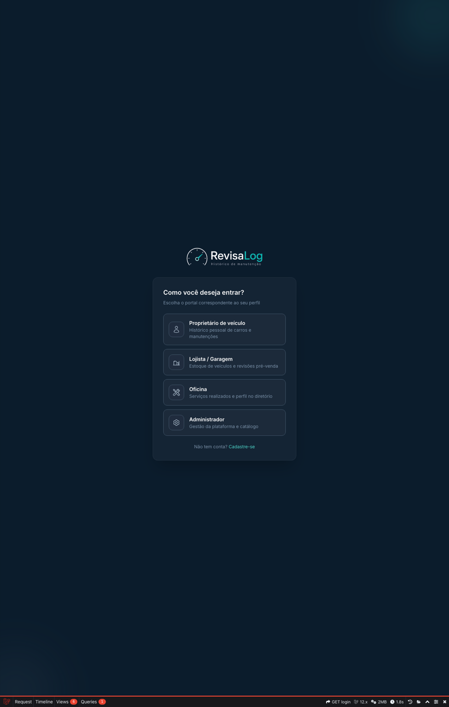
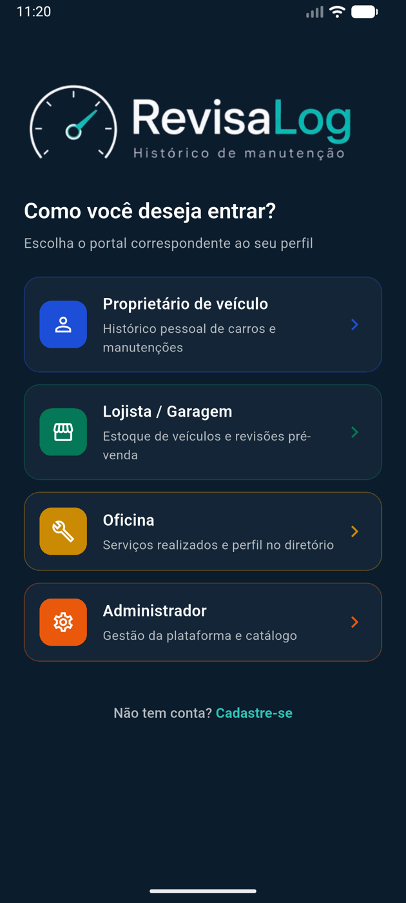

# Revisalog

Maintenance history that belongs to the vehicle (chassis/VIN), not to the owner.  
https://revisalog.com.br

Laravel API and web portal for vehicle service history. Mobile client: [vehicle_maintenance_frontend](https://github.com/fellipesg/vehicle_maintenance_frontend).

## What it does

- Register vehicles (plate / RENAVAM) and keep a permanent maintenance log
- Chassis (VIN) as the primary identity, with plate history over time
- Maintenance provenance: workshop seal (verifiable via code + QR at `/v/{code}`) vs declared by owner/garage
- Provenance strip and filters on vehicle timelines (web and API)
- Workshops, service categories, and checklists
- Upload invoices (NF-e XML and DANFE PDF); line items can be applied to a maintenance
- Import vehicles from a CRLV-e PDF with a preview/confirmation step before saving; unreadable files are reported to Sentry and e-mailed to support
- Maintenance mileage validated against the service date (floor from the previous record/odometer, ceiling from the next one)
- Export a history PDF and email it to the owner with invoice files attached (queued job)
- Web portals for owners, workshops/garages, and catalog admin
- Legal pages (`/termos`, `/privacidade`) and a contact form (`/contato`) with honeypot, throttle and optional Cloudflare Turnstile
- Account deletion from the app (`DELETE /api/v1/me`): anonymizes the user, revokes tokens/FCM, keeps the maintenance history on the VIN
- Queued welcome e-mail and internal new-signup alert, on Revisalog-branded transactional templates
- REST API (`/api/v1`) for the Flutter app (Sanctum, per-token abilities)

## Stack

| Layer | Local | Production |
| --- | --- | --- |
| Runtime | PHP 8.4, Laravel 12 | Laravel Cloud |
| Database | Postgres 17 (Docker) or SQLite | Neon Postgres |
| Files | Local disk | Amazon S3 (optional Cloudflare R2 for vehicle covers) |
| Queue | `database` driver (`queue:listen`) | Same driver, workers on Cloud |
| Auth | Sanctum, Socialite | Same |
| Observability | Log / Telescope (dev) | Sentry |
| Web UI | Blade, Vite, Tailwind | Same |

PDF: DomPDF, smalot/pdfparser, FPDI. Push: Firebase Admin (FCM).

## Requirements

Docker (Compose v2, or v1 via `make ... DC=docker-compose`) and `make`. Nothing else is needed on the host: PHP 8.4, Postgres 17 and Node 22 all run in containers, so the host PHP/Node versions don't matter.

Running without Docker needs PHP 8.4+ (`pdo_sqlite` / `pdo_pgsql`, `mbstring`, `xml`, `bcmath`, `fileinfo`, `gd`, `intl`), Composer 2 and Node 20.19+ (Vite 7).

## Quick start (Docker)

```bash
git clone https://github.com/fellipesg/vehicle_maintenance.git
cd vehicle_maintenance
make install   # .env, composer + npm deps, APP_KEY, migrations, asset build
make dev       # optional: Vite dev server with HMR (Ctrl-C to stop)
```

- App: http://localhost:8080 (API: `/api/v1`)
- Postgres from the host: `localhost:5433`, db `vehicle_maintenance`, user `vehicle`, password `secret`

| Command | What it does |
| --- | --- |
| `make up` / `make down` | Start / stop app (php-fpm), nginx, db, queue, scheduler. `down` keeps the DB volume |
| `make dev` | Vite dev server in a Node 22 container on :5173 |
| `make build` | Production assets into `public/build` |
| `make test` | Test suite in the container (SQLite in-memory, `phpunit.xml`) |
| `make test-pgsql` | Same suite against the compose Postgres (`phpunit.pgsql.xml`, db `vehicle_maintenance_test`) |
| `make migrate` / `make shell` / `make logs` | Migrations, bash in the app container, follow logs |

`make help` lists everything. Without make: `docker compose up -d --build`, `docker compose exec app php artisan …`.

Notes:

- The compose `environment:` overrides `.env` for the database (`DB_CONNECTION=pgsql`, `DB_HOST=db`, …), so `.env` can stay on SQLite.
- Ports: `APP_PORT` (8080) and `FORWARD_DB_PORT` (5433), e.g. `APP_PORT=8090 make up`.
- `queue` runs `queue:work database --timeout=300 --tries=2`, like production.
- Xdebug is installed but off: `XDEBUG_MODE=debug make up`.
- Linux: `WWWUSER=$(id -u) WWWGROUP=$(id -g) make up` so files written by the containers are owned by you.

## Quick start (no Docker)

```bash
composer install
cp .env.example .env
php artisan key:generate
touch database/database.sqlite
php artisan migrate
npm install && npm run build
composer run dev
```

`composer run dev` starts the HTTP server (http://127.0.0.1:8000), a queue worker, Vite, and log tailing.

## Production notes (Laravel Cloud + Neon + S3)

This app runs on Laravel Cloud with:

- **Neon Postgres** as the database
- **S3** for invoices and generated PDFs
- **Database queue** (no Redis required in prod)
- A worker that runs `EmailVehicleMaintenancePdf`: builds the history PDF, loads invoice objects from S3, and mails them as attachments (300s timeout, 2 tries)

### Postgres booleans

Laravel binds PHP `true`/`false` as `0`/`1`. Neon/Postgres treats that as integer, aborts the transaction, and the next statement can fail with `SQLSTATE[25P02]` (the original error is gone). This project uses `App\Database\PostgresConnection` so booleans are sent as `true`/`false`. Prefer the Neon host **without** `-pooler` for Laravel; if you must use the pooler, keep `DB_PGBOUNCER=true` (see `.env.example`).

### Typical production env

```env
DB_CONNECTION=pgsql
DB_HOST=ep-....aws.neon.tech
DB_PORT=5432
DB_SSLMODE=require
FILESYSTEM_DISK=s3
QUEUE_CONNECTION=database
SESSION_DRIVER=cookie
CACHE_STORE=file
```

Never commit `.env`, AWS keys, or Firebase service-account JSON.

## Environment

| Variable | Role |
| --- | --- |
| `APP_KEY` | `php artisan key:generate` |
| `APP_URL` | Public URL (OAuth and signed links) |
| `DB_*` | SQLite or Postgres/Neon (Docker sets these itself) |
| `FILESYSTEM_DISK` | `local` or `s3` |
| `AWS_*` | S3 bucket and credentials |
| `QUEUE_CONNECTION` | `database` in this project |
| `MAIL_*` | Machine: `log` only (never Mailpit / local SMTP). Production (Laravel Cloud): `resend` + `RESEND_API_KEY`. From `noreply@revisalog.com.br`, reply-to `suporte@revisalog.com.br` (`MAIL_SUPPORT_ADDRESS` also receives contact-form and CRLV-failure mail) |
| `SENTRY_DSN` | Exception reporting |
| `GOOGLE_*` / `FACEBOOK_*` / `TWITTER_*` | Socialite (`*_CLIENT_ID`, `*_CLIENT_SECRET`, `*_REDIRECT_URI` — see [OAUTH_SETUP.md](OAUTH_SETUP.md)) |
| Firebase | `FIREBASE_CREDENTIALS_PATH` locally, `FIREBASE_CREDENTIALS_BASE64` on Cloud. Service account never in git |
| `TURNSTILE_SITE_KEY` / `TURNSTILE_SECRET_KEY` | Captcha on `/contato`. Empty: captcha off, honeypot + throttle stay on |
| `LEGAL_COMPANY_NAME` / `LEGAL_COMPANY_CNPJ` | Footer © line, once the company exists |
| `CORS_ALLOWED_ORIGINS` | Comma-separated. Empty: `*` locally, only `APP_URL` in production. Credentials are enabled whenever the list is not `*` |
| `API_DOCS_ENABLED` / `API_DOCS_USERNAME` / `API_DOCS_PASSWORD` | Scramble docs at `/docs/api`. Basic Auth required in production (404 there when unset) |
| `VEHICLE_COVERS_DISK` / `R2_*` | Optional Cloudflare R2 disk for vehicle covers |
| `DB_QUEUE_RETRY_AFTER` | Must exceed the longest job timeout (PDF job: 300s) |

## Tests

```bash
composer test
# or
php artisan test
```

Docker: `make test` (SQLite) or `make test-pgsql` (Postgres, closer to production).

Current state: 463 passing, 2 skipped. The two skipped ones are the Flutter launcher-icon checks in `tests/Unit/BrandAppIconCropTest.php`; they only run when the mobile repo is checked out as a sibling `frontend/` directory next to this one.

Coverage includes invoice parsers, CRLV import and preview, mileage validation, portal authorization, CORS and API-docs access, contact form, account deletion, and Postgres boolean binding.

GitHub Actions (`.github/workflows/ci.yml`) runs the suite on every push to `main` and on every pull request, twice — SQLite and Postgres 17 — plus `vendor/bin/pint --test` in a separate job. Pint currently fails on 15 pre-existing files, so that job is red until they are formatted.

## API (overview)

Prefix: `/api/v1`. Authenticated routes use Sanctum (`Authorization: Bearer …`), the `tenant` middleware and per-token abilities (`vehicles:read`, `maintenances:write`, `profile:write`, …). Full list: `php artisan route:list --except-vendor --path=api`, or the OpenAPI docs at `/docs/api`.

| Area | Examples |
| --- | --- |
| Auth | `POST /register`, `POST /login`, `POST /logout`, `GET /me`, `GET /auth/{provider}/redirect` + `/callback` |
| Two-factor | `POST /two-factor/challenge` (public), `enable` / `confirm` / `disable` / `recovery-codes` (authenticated) |
| Profile | `PUT /me`, `POST /me/avatar`, `DELETE /me` (anonymizes the account, keeps the VIN history) |
| Vehicles | CRUD, `GET /my-vehicles` (ETag), `GET /vehicles/{id}/maintenances`, `GET /vehicles/{id}/plates`, `GET /vehicles/{id}/timeline`, `POST /vehicles/{id}/cover`, `POST /vehicles/{id}/link` (claim an unowned vehicle; requires `license_plate` + `renavam` from the vehicle document, 10 attempts/min) |
| PDF export | `POST /vehicles/{id}/export-pdf` → `GET /vehicle-pdf-exports/{id}` (poll) → `GET /vehicle-pdf-exports/{id}/download` |
| Search | `GET /vehicles/search/{identifier}` (plate, RENAVAM, or chassis); `matched_by` in responses; `?verified=1` / `?verified=0` on maintenance lists |
| Verification | `GET /v/{code}` (web) — public maintenance seal page |
| Maintenances | CRUD + photo upload/delete on `/maintenances/{id}/photos` |
| Invoices | upload / download / delete |
| Workshops | public list/show + authenticated write, plus `workshops/{id}/message-templates` and `workshops/{id}/warranty-templates` |
| Legal | `GET /legal/terms-of-use`, `GET /legal/privacy-policy` (public) |
| FCM | token register / list / delete |

Rate limits (`app/Providers/AppServiceProvider.php`): `auth` on login/register/OAuth callback, `api` 60/min per user or IP, `search` 20/min per IP, `uploads` 10/min, `two-factor` 5 tries per challenge plus a per-IP cap, `contact` 5/min per IP.

Web (Blade): owner portal, workshop/garage flows, admin brand/model catalog, legal pages and contact form. See `routes/web.php`.

## Screenshots

| | |
| --- | --- |
| Owner portal — chassis & plate chip |  |
| Provenance strip & filters |  |
| Maintenance with workshop seal |  |
| Exported PDF |  |
| Flutter (iOS) |  |
| Flutter (Android) |  |

## Layout

```
app/
  Http/Controllers/Api/    REST
  Http/Controllers/Web/    Blade portals (User, Garage, Workshop, Admin, Legal, Contact)
  Jobs/                    EmailVehicleMaintenancePdf
  Events/ Listeners/       UserRegistered → welcome mail, ops alert, welcome push
  Mail/ Notifications/     Transactional mail and database/FCM notifications
  Policies/                Vehicle, Maintenance, Invoice, Workshop authorization
  Services/                Crlv, Invoice, Maintenance, User, Vehicle, Workshop, Geo
  Support/                 AppStorage, Firebase credentials, plate search helpers
  Database/                PostgresConnection (boolean binding)
config/                    legal.php (terms/privacy copy), cors.php, maintenance_intervals.php
database/migrations/
resources/views/           portals, legal/, emails/, vendor/mail/ (Revisalog chrome)
routes/api.php             + routes/api-two-factor.php
routes/web.php
docker/                    nginx, php (+ xdebug), postgres init
.ai/rules/                 committed rules; read .ai/rules/index.md before editing
tests/
```

## Scripts

```bash
composer run setup    # install, .env, migrate, npm build
composer run dev      # serve + queue + vite + logs
composer run test
vendor/bin/pint       # code style
```

## More docs

- [OAUTH_SETUP.md](OAUTH_SETUP.md) — Google/Socialite credentials and callback URLs
- [docs/qa-api-handoff.md](docs/qa-api-handoff.md) — API and portal test guide for QA (no credentials in the file)
- [AGENTS.md](AGENTS.md) and `.ai/rules/` — conventions and committed rules for coding agents

## License

MIT. See [LICENSE](LICENSE).
